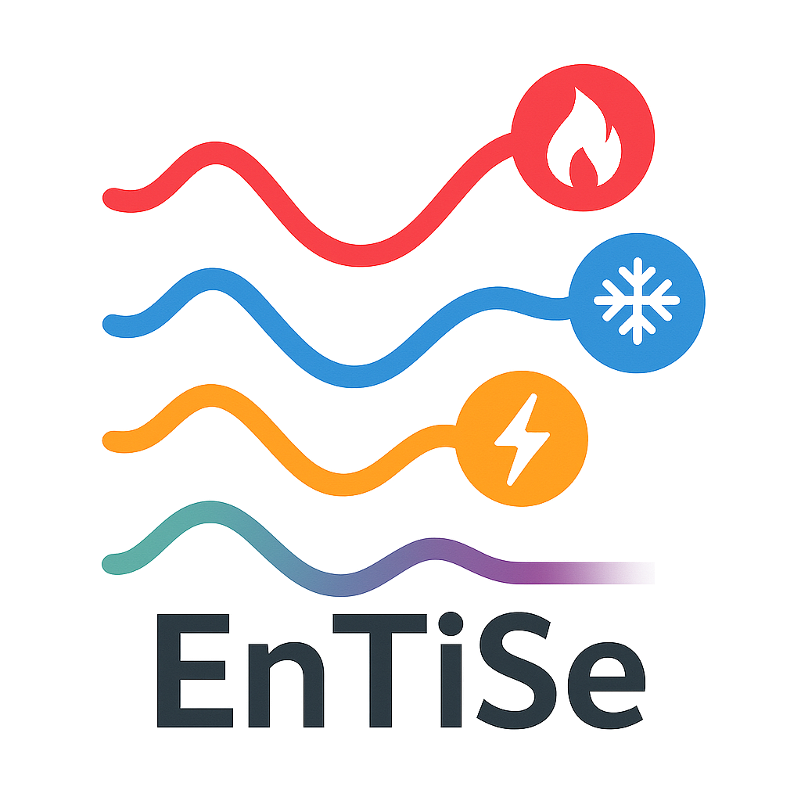

|badge_license| |badge_pypi| |badge_python| |badge_documentation|

A simple tool for generating time series data related to energy systems and building operations.

.. contents::
    :depth: 1
    :local:
    :backlinks: top

Introduction
=============
**EnTiSe** (En-ergy Ti-me Se-ries) is a Python package designed to generate realistic time series data for various energy systems and building operations.
It provides a flexible, pipeline- and strategy-based approach to create time series for different applications including HVAC, domestic hot water, electricity, mobility, and occupancy patterns.

Key Features
-------------
- Multiple time series types including DHW, HVAC, PV, and more in the works.
- Flexible pipeline- and strategy-based architecture for customizable time series generation.
- Support for dependent methods to create related time series.
- Two access patterns: batch processing via TimeSeriesGenerator or direct method imports for individual control.

Getting Started
================
To get started, follow these steps:

Requirements
-------------
- `Python <https://www.python.org/>`_ (3.10 or newer)
- `Git <https://git-scm.com/>`_ for version control (optional, only for development)

Installation
-------------
EnTiSe can be installed directly from PyPI:

.. code-block:: bash

   pip install entise

For faster installation, you can use `uv <https://github.com/astral-sh/uv>`_:

.. code-block:: bash

   pip install uv
   uv pip install entise

For development or the latest features, you can install directly from the repository:

.. code-block:: bash

   pip install git+https://github.com/tum-ens/entise.git

Or clone the repository and install in development mode:

.. code-block:: bash

   git clone https://github.com/tum-ens/need/entise.git
   cd entise
   pip install -e ".[dev]"

Now you're ready to use EnTiSe! Check the examples directory for usage examples.

Repository Structure
=====================

- **entise/**: Main project code organized in a Python package.

  - **constants/**: Definitions of time series types and other constants.
  - **core/**: Core functionality and base classes.
  - **data/**: Data files and data handling utilities.
  - **methods/**: Implementation of various time series generation methods.
  - **services/**: Auxiliary services supporting the core functionality.
- **tests/**: Folder for tests; structured by functionality.
- **docs/**: Documentation source files.
- **examples/**: Example scripts demonstrating usage of the package.

Usage Guidelines
=================

Basic Usage
------------

EnTiSe provides two flexible ways to generate time series data:

Batch Processing
~~~~~~~~~~~~~~~~~~~~~~~~~~~~~~~

For generating multiple time series at once, you can use the `Generator` and either add objects one by one or in bulk using DataFrames or dictionaries:

.. code-block:: python

   from entise import Generator

   # Initialize the generator
   gen = Generator()

   # Add objects (e.g., buildings)
   gen.add_objects({
       "id": "building1",
       "hvac": "1R1C",
       "resistance": 2.0,
       "capacitance": 1e5,
       "temp_min": 20.0,
       "temp_max": 24.0,
   })

   # Prepare input data (e.g., weather)
   data = {
       "weather": pd.DataFrame({
           "temp_out": [0.0] * 24,
       }, index=pd.date_range("2025-01-01", periods=24, freq="h"))
   }

   # Generate time series
   summary, df = gen.generate(data)

Direct Method Access
~~~~~~~~~~~~~~~~~~~~~~~~~~~~~~~

For more granular access you can work with the methods directly:

.. code-block:: python

   from entise.methods.pv import PVLib

   # Create an instance
   pvlib = PVLib()

   # Generate time series
   result = pvlib.generate(
       latitude=48.1,
       longitude=11.6,
       power=5000,
       weather=weather_df
   )

   # Access results
   summary = result["summary"]
   timeseries = result["timeseries"]

For more detailed examples, check the `examples` directory.

Supported or Planned Time Series Types
---------------------------------------
EnTiSe supports generating time series for the following types:

Integrated:

- Electricity demand
- Domestic Hot Water (DHW)
- Heat pump (COP)
- HVAC (Heating, Ventilation, and Air Conditioning)
- Occupancy data
- Solar Photovoltaic (PV)
- Wind energy

Planned:

- Concentrated Solar Power (CSP) (https://oemof-thermal.readthedocs.io/en/latest/concentrating_solar_power.html)
- Geothermal energy
- Hydroelectric power (https://github.com/IdahoLabResearch/HydroGenerate or https://github.com/9505-PNNL/wmpy_power or https://www.theoj.org/joss-papers/joss.03294/10.21105.joss.03294.pdf)
- Mobility (https://emobpy.readthedocs.io/en/latest/)
- Solar thermal (https://oemof-thermal.readthedocs.io or https://www.theoj.org/joss-papers/joss.03294/10.21105.joss.03294.pdf)
- Tidal energy
- Wave energy

Documentation
==============
Please see the `documentation <https://entise.readthedocs.io>`_ for further information.

Contribution and Code Quality
==============================
We are happy if you want to contribute to this repository! Have a look at the guides in our docs for more information on how to contribute and our coding standards.

Coding Standards
-----------------
This repository follows consistent coding styles. Refer to `CONTRIBUTING.md <./docs/guides/CONTRIBUTING.md>`_ for detailed standards.

Changelog
----------
The changelog is maintained in the `CHANGELOG.md <CHANGELOG.md>`_ file.
It lists all changes made to the repository.
Follow instructions there to document any updates.

License and Citation
=====================
| The code of this repository is licensed under the **MIT License** (MIT).
| See `LICENSE <LICENSE>`_ for rights and obligations.
| Copyright: `EnTiSe <https://gitlab.lrz.de/tum-ens/need/entise>`_ (c) `TU Munich - ENS <https://www.epe.ed.tum.de/en/ens/homepage/>`_ | `MIT <LICENSE>`_

.. |badge_license| image:: https://img.shields.io/badge/license-MIT-blue
    :target: LICENSE
    :alt: License

.. |badge_documentation| image:: https://img.shields.io/badge/docs-available-brightgreen
    :target: https://gitlab.lrz.de/tum-ens/need/entise
    :alt: Documentation

.. |badge_contributing| image:: https://img.shields.io/badge/contributions-welcome-brightgreen
    :target: CONTRIBUTING.md
    :alt: contributions

.. |badge_contributors| image:: https://img.shields.io/badge/contributors-0-orange
    :alt: contributors

.. |badge_repo_counts| image:: https://img.shields.io/badge/repo-count-brightgreen
    :alt: repository counter

.. |badge_issue_open| image:: https://img.shields.io/badge/issues-open-blue
    :target: https://gitlab.lrz.de/tum-ens/need/entise/-/issues
    :alt: open issues

.. |badge_issue_closes| image:: https://img.shields.io/badge/issues-closed-green
    :target: https://gitlab.lrz.de/tum-ens/need/entise/-/issues
    :alt: closed issues

.. |badge_pr_open| image:: https://img.shields.io/badge/merge_requests-open-blue
    :target: https://gitlab.lrz.de/tum-ens/need/entise/-/merge_requests
    :alt: open merge requests

.. |badge_pr_closes| image:: https://img.shields.io/badge/merge_requests-closed-green
    :target: https://gitlab.lrz.de/tum-ens/need/entise/-/merge_requests
    :alt: closed merge requests

.. |badge_pypi| image:: https://img.shields.io/pypi/v/entise
    :target: https://pypi.org/project/entise/
    :alt: PyPI

.. |badge_python| image:: https://img.shields.io/pypi/pyversions/entise
    :target: https://pypi.org/project/entise/
    :alt: Python Version

.. |badge_github_actions| image:: https://github.com/tum-ens/need/entise/actions/workflows/python-package.yml/badge.svg
    :target: https://github.com/tum-ens/need/entise/actions/workflows/python-package.yml
    :alt: GitHub Actions

.. |badge_gitlab_ci| image:: https://gitlab.lrz.de/tum-ens/need/entise/badges/main/pipeline.svg
    :target: https://gitlab.lrz.de/tum-ens/need/entise/-/pipelines
    :alt: GitLab CI
