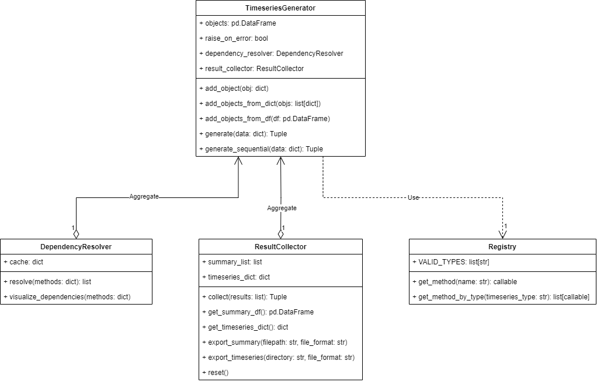

.. _architecture:

Architecture
============

   High-level component view: Generator orchestrates batch execution, Runner resolves strategies and dependencies,
   and concrete Method implementations produce summaries and timeseries.

Purpose of this page
--------------------
This page explains the static building blocks (modules, classes, responsibilities) and their interactions.
It complements the :ref:`workflow` page, which focuses on the runtime lifecycle, user steps, and decision making.
Use this page when you want to understand how EnTiSe is put together or when you plan to extend it with new methods.

Core components
---------------

Generator (entise.core.generator.Generator)
~~~~~~~~~~~~~~~~~~~~~~~~~~~~~~~~~~~~~~~~~~~

  - Public entry point for batch processing.
  - Holds the objects table (metadata) and orchestrates parallel or sequential execution.
  - Splits the input into per-object "keys" (metadata), shared "data" (timeseries inputs), and the selected
    strategies per timeseries type (e.g., hvac → "1R1C", pv → "pvlib").
  - Aggregates per-object summaries into a DataFrame and returns per-object, per-type timeseries.

Runner (entise.core.runner.Runner)
~~~~~~~~~~~~~~~~~~~~~~~~~~~~~~~~~~

  - Executes all configured types for a single object.
  - For each type, calls resolve(ts_type) → locates the configured strategy and instantiates the corresponding Method.
  - Ensures dependencies required by a method are available: either computed first for the same object or accepted if
    provided via input data.
  - Caches results per type for the object so dependencies are only computed once.

Method base class (entise.core.base.Method)
~~~~~~~~~~~~~~~~~~~~~~~~~~~~~~~~~~~~~~~~~~~

  - Defines the interface and the contract all concrete methods must fulfill.
  - Class attributes declare the method’s surface:
    - types: list of supported timeseries types (see entise.constants.ts_types.Types)
    - name: strategy name used for selection (registered automatically)
    - required_keys / optional_keys: scalar parameters expected in the object metadata
    - required_data / optional_data: names of required/optional input timeseries in data
    - output_summary / output_timeseries: keys and human-readable descriptions for produced outputs
  - Provides helpers for common tasks:
    - _process_kwargs(...): merge explicit parameters with obj/data dicts
    - resolve_column(...): consistent access to method-prefixed or generic column names
    - get_with_backup(...) and get_with_method_backup(...): parameter lookup with method-specific fallbacks
    - _strip_weather_height(...) and _obtain_weather_info(...): normalization utilities for weather frames

Registry and strategy selection
~~~~~~~~~~~~~~~~~~~~~~~~~~~~~~~

  - Methods register themselves via the Method metaclass (entise.core.base.MethodMeta). Their lower-cased name becomes
    the strategy key.
  - The Runner retrieves a strategy class from the central registry via entise.core.registry.get_strategy(name).

Constants and naming (entise.constants)
~~~~~~~~~~~~~~~~~~~~~~~~~~~~~~~~~~~~~~~

  - Types: canonical names for timeseries domains (hvac, hp, pv, electricity, ...)
  - Objects: keys used in object metadata (e.g., resistance[K W-1], latitude[degree], weather)
  - Columns: canonical column names for input/output frames following the pattern name[unit](@height)

Data flow and call sequence
---------------------------

1. User prepares objects and data and calls Generator.generate(data, workers=N).
2. Generator creates a Runner for each object and asks it to run all configured types.
3. Runner.resolve(ts_type):

   - Looks up the selected strategy (e.g., "1R1C" → HVAC.R1C1, "pvlib" → PV.PVLib).
   - Ensures all required_data are present. If a required type is configured for the same object, it resolves that first.

4. Method.generate(obj, data, results, ts_type) is called to compute outputs for the type.
5. Runner stores the result; Generator aggregates summaries and returns (summary_df, results_dict).

Execution model and performance
-------------------------------

- Parallelism: Generator uses joblib to run objects in parallel (workers != 1). Each process maintains its own caches
  (e.g., preprocessed weather). Use workers=1 for deterministic debugging or small jobs; use -1 to utilize all cores.
- Error handling: By default, errors inside a method propagate. Configure raise_on_error on the Generator to adapt
  handling if you wish to catch/record errors (implementation may vary per version).
- Determinism: Methods that include stochastic elements should accept a seed in the object metadata to make runs
  reproducible.

Extension points (how to add a new method)
------------------------------------------

1. Create a new class inheriting from Method in entise/methods/<domain>/, for example entise/methods/pv/my_method.py.
2. Set class attributes appropriately:
   - types = [Types.PV] (or multiple types if your method supports them)
   - name = "my_method" (used as strategy selector, auto-registered via metaclass, MUST be unique across all methods)
   - required_keys / optional_keys and required_data / optional_data
   - output_summary / output_timeseries (keys and human-readable descriptions)
3. Implement generate(self, obj, data, results, ts_type) and return a dict with
   - "summary": dict of KPIs (keys should match output_summary)
   - "timeseries": pandas.DataFrame with a datetime index/column and columns as defined in output_timeseries
4. Import your class in the package’s __init__.py of that domain so it’s importable (e.g., entise.methods.pv.__init__).
5. Select the strategy in your objects by setting the timeseries type key to your method’s name, e.g. {"pv": "my_method"}.

See the constants in entise.constants for canonical type and column names to ensure consistency across methods and domains.

Choosing between methods for the same object
--------------------------------------------
The architecture naturally supports multiple methods per object. Each type key in the object selects a strategy
independently (e.g., {"hvac": "1R1C", "hp": "ruhnau", "pv": "pvlib"}). Dependencies, if any, are resolved per object
within Runner; independent types run side-by-side and share common inputs like weather.

Design principles
-----------------

- Separation of concerns: Object metadata vs. input timeseries vs. algorithmic method implementation are cleanly
  separated so you can scale objects and swap strategies without rewriting pipelines.
- Explicit contracts: Methods declare their inputs and outputs in class attributes; this enables validation and
  consistent documentation across domains.
- Extensibility first: New methods can be added without touching the core orchestration code.
