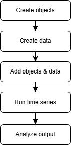

.. _workflow:

Workflow
========

   High-level workflow (see sections below for dependency resolution, decision guide, and troubleshooting).

This section provides an overview of the EnTiSe workflow, detailing the lifecycle of generating timeseries data from object definitions and input data. Follow these steps to seamlessly integrate EnTiSe into your projects.

Overview
--------

EnTiSe processes data in the following stages:

1. **Object Definition**: Define the metadata for the timeseries generation.
2. **Input Data Preparation**: Provide the required timeseries input data.
3. **Dependency Resolution**: Ensure all methods are executed in the correct order.
4. **Timeseries Generation**: Generate timeseries data and compute summary metrics.
5. **Output Collection**: Collect and export results for further analysis.

Detailed Steps
--------------

1. Define Objects
~~~~~~~~~~~~~~~~~

Objects represent the entities for which timeseries data will be generated. Each object should have:

    - A unique identifier (``Objects.ID``).
    - References to the methods and input data required for processing.

In this example we are creating the timeseries for a building's thermal behavior, so we define an object with the necessary metadata for both HVAC and heat pump methods, as well as shared inputs like weather. Each method may require specific parameters (e.g., resistance and capacitance for HVAC, source/sink types for heat pumps) that should be included in the object definition. You can look up the required and optional parameters for each method in the :ref:`methods` section.

Shared inputs (like weather) can be referenced by multiple methods for the same object, allowing for efficient reuse of data across different timeseries types. If you want to tie a specific input to a method, you can use the convention of writing the input key as ``{method}:{input}`` (e.g., ``hvac:weather``) to make it clear which method uses which input.

.. code-block:: python

    objects = [
        {
            "id": "building1",
            # Methods per type for the SAME object
            "hvac": "1R1C",
            "hp": "ruhnau",
            # Shared inputs and parameters
            "weather": "weather",
            # HVAC parameters
            "resistance[K W-1]": 2.0,
            "capacitance[J K-1]": 1e5,
            # Heat pump parameters for Ruhnau (typical defaults shown)
            "hp_source": "air",         # air, soil, water
            "hp_sink": "radiator",      # radiator, floor, water
        }
    ]

2. Prepare Input Data
~~~~~~~~~~~~~~~~~~~~~

Input data provides the raw timeseries required for processing. Ensure your data includes:

    - All required columns specified by the methods.
    - Compatible formats (e.g., ``pandas.DataFrame``).

Example:

.. code-block:: python

    import pandas as pd

    # Minimal weather DataFrame needed by HVAC 1R1C and HP Ruhnau:
    # requires a datetime index/column and outdoor temperature
    idx = pd.date_range("2025-01-01", periods=48, freq="30min", tz="UTC")
    weather_df = pd.DataFrame({
        "datetime": idx,
        "air_temperature[C]": 0.0,
    }, index=idx)

    data = {"weather": weather_df}

3. Add Objects and Input Data
~~~~~~~~~~~~~~~~~~~~~~~~~~~~~

Use the ``Generator`` to add your objects and input data for processing. The generator will handle the orchestration of method execution based on the object definitions and available data. Alternatively, you can run the methods directly (see the “Direct Method Access” section below), but using the generator allows for automatic dependency resolution and batch processing.

.. code-block:: python

    from entise.core.generator import Generator

    # Initialize the generator
    gen = Generator()

    # Add objects
    gen.add_objects(objects)

4. Dependency Resolution
~~~~~~~~~~~~~~~~~~~~~~~~

EnTiSe ensures that methods with dependencies are executed in the correct order. This is handled automatically by the dependency resolver:

- If a configured method requires another timeseries type, EnTiSe computes that dependency first.
- Independent methods for the same object (e.g., HVAC and HP) run side‑by‑side using the shared inputs (like ``weather``).

Please ensure that the methods do not have circular dependencies, as this will cause an error. If you encounter a dependency error, check that all required inputs are provided and that the method configurations are correct.

5. Generate Timeseries
~~~~~~~~~~~~~~~~~~~~~~

Generate timeseries data with the specified number of worker processes. EnTiSe uses joblib for parallel processing, which can significantly speed up generation when you have many objects. For debugging or smaller runs, you can set ``workers=1`` to run sequentially. Please note that some API integreated methods, like pyLPG, may not support parallel execution due to internal state or caching, so check the method documentation if you encounter issues.

.. code-block:: python

    # With multiple workers (parallel processing)
    summary, results = gen.generate(data, workers=4)

    # With a single worker (sequential processing, easier for debugging, faster for small runs)
    summary, results = gen.generate(data, workers=1)

6. Collect and Export Results
~~~~~~~~~~~~~~~~~~~~~~~~~~~~~

Once processing is complete, you can access and export your results. The per‑object results is a dict keyed by object id, and each entry is another dict keyed by timeseries type (e.g., "hvac", "hp").

- **Access Summary Metrics**:

.. code-block:: python

    # Summary KPIs per object (rows indexed by object id)
    print(summary)

- **Access per‑type timeseries for an object**:

.. code-block:: python

    res_obj = results["building1"]
    hvac_ts = res_obj["hvac"]  # indoor temperature, heating/cooling loads
    hp_ts = res_obj["hp"]      # heat pump COP timeseries

- **Export Timeseries**:

.. code-block:: python

    # Export each type separately
    hvac_ts.to_csv("output/building1_hvac.csv")
    hp_ts.to_csv("output/building1_hp.csv")

Alternative Workflow: Direct Method Access
------------------------------------------

If you prefer to call a single method directly (for tighter control or easy embedding), see the minimal example in :ref:`getting_started` under “Direct Method Access,” and explore the :ref:`examples` for full scripts and notebooks. This keeps the Workflow page focused on concepts while runnable code lives in the quickstart and examples.

Decision Guide
--------------

- Batch vs. Direct method:
  - Use batch processing with ``Generator`` when you have many objects, want dependency resolution, and prefer a single call that returns everything reproducibly.
  - Use direct methods (e.g., ``PVLib().generate(...)``) when you focus on one method, need low-level control, or embed EnTiSe in an existing pipeline.
- Strategy selection cues (examples):
  - Solar gains/PV: If you have DNI/DHI/GHI columns, strategies that use them will be selected; with only GHI, EnTiSe may fall back to simpler transposition.
  - Internal gains: Provide an explicit timeseries when available; otherwise rely on built‑in defaults or occupancy-based strategies if configured.
- Workers: Prefer ``workers=1`` for debugging; increase to utilize cores for production runs.

Data Contracts (Schemas)
------------------------

- Time index and alignment:
  - Timeseries DataFrames must include a ``datetime`` column; EnTiSe will set or expect it as the index in many methods.
  - Use a regular frequency (e.g., 15min, 1h). Avoid gaps for best results. Timezone-aware indices (UTC recommended) reduce ambiguity.
- Weather data common columns (examples):
  - ``outdoor_temperature[C]``, ``global_horizontal_irradiance[W m-2]``, ``direct_normal_irradiance[W m-2]``, ``diffuse_horizontal_irradiance[W m-2]``, ``wind_speed[m s-1]``, ``relative_humidity[1]``.
  - Column names follow the pattern ``name[unit]`` (optionally with height ``@2m`` etc.).
- Objects (metadata): always include ``id`` and method/strategy selectors per type, e.g. ``{"id": "building1", "hvac": "1R1C", "weather": "weather"}``.
- Method-specific keys (examples):
  - HVAC 1R1C: ``resistance[K W-1]``, ``capacitance[J K-1]``, optional ``power_heating[W]``, ``power_cooling[W]``, temperature setpoints.
  - PV pvlib: ``latitude[degree]``, ``longitude[degree]``, optional ``power[W]``, ``azimuth[degree]``, ``tilt[degree]``.

Performance and Reproducibility
-------------------------------

- Parallelism: ``Generator.generate(data, workers=N)`` leverages joblib. Use ``workers=-1`` for all cores; use ``1`` for deterministic, easier-to-debug runs.
- Caching: Some methods cache preprocessed inputs (e.g., normalized weather) within a process to reduce overhead across many objects.
- Determinism: When methods include randomness, provide a ``seed`` in objects to lock results for reproducible runs.

Validation and Troubleshooting
------------------------------

- Missing columns: Errors like “column not found” usually indicate a mismatch between expected names/units and your DataFrame. Check the column naming pattern and method docs.
- Datetime issues: Ensure ``datetime`` can be parsed, is monotonic, and preferably timezone-aware. Non-regular indices may reduce accuracy or cause failures in some strategies.
- Dependency errors: If a required dependency is not provided as input data nor producible by a configured strategy, add the missing input or configure the upstream type.
- Quick checks: Start with a single object and ``workers=1``; print the first few rows of inputs; use a shorter time window to iterate faster.
